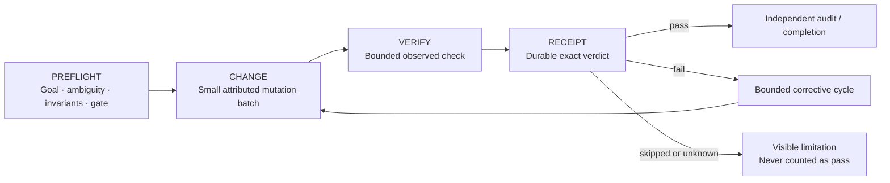
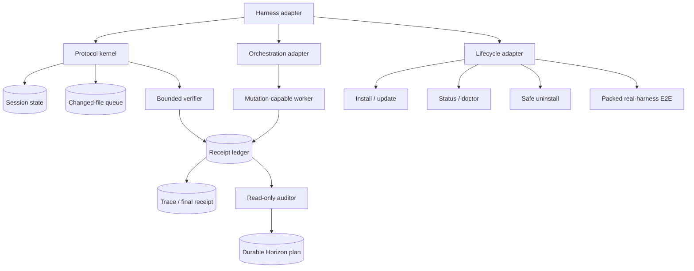
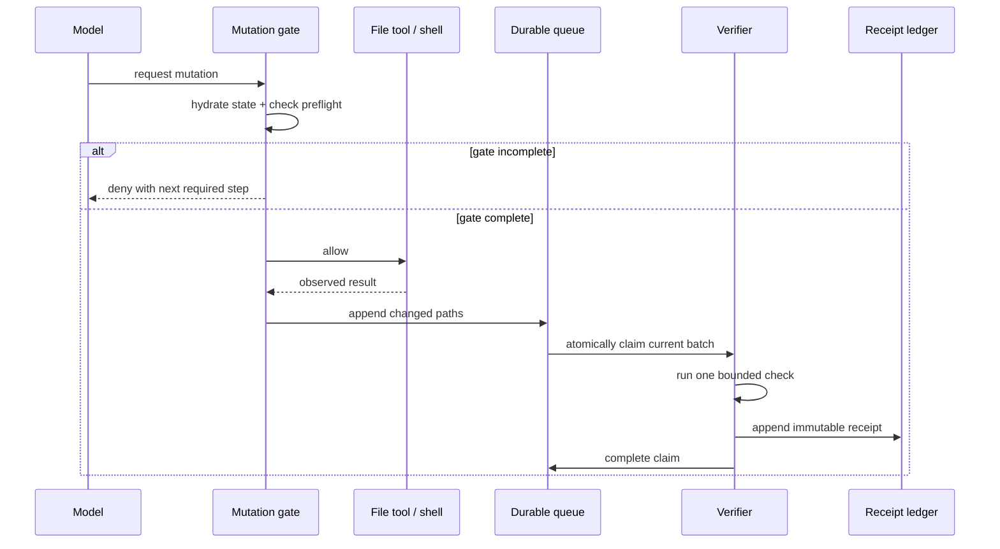
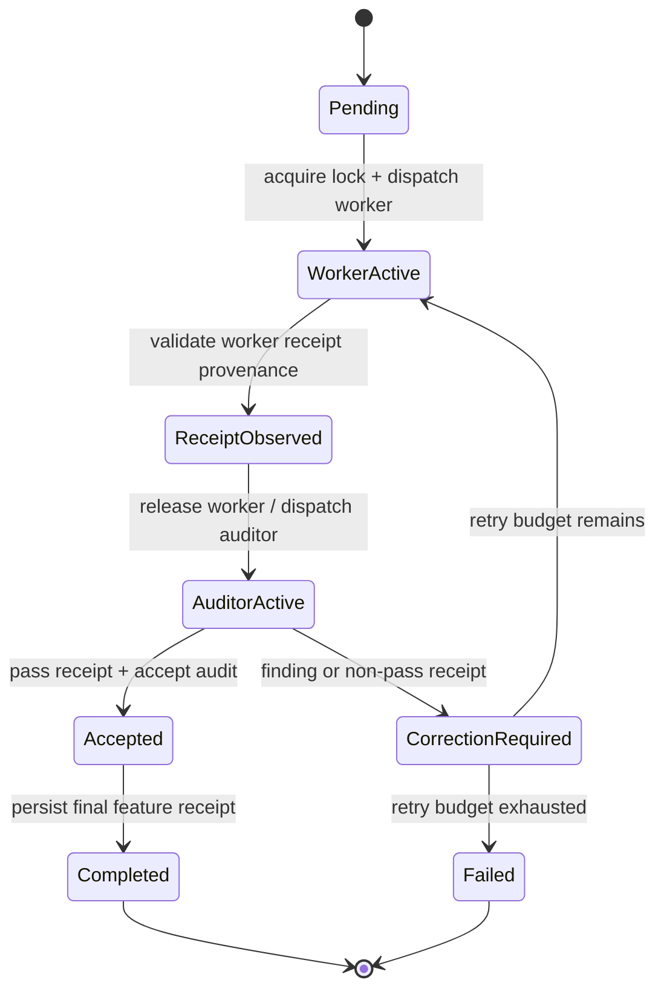
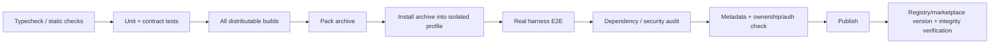

# Parallax Harness Porting Blueprint

> **Reference implementation:** `parallax-opencode@0.7.3` / Git commit `51c2df4`
>
> **Targets:** Pi Agent and Anthropic Claude Code
>
> **Purpose:** Reproduce the verified behavior—not the OpenCode implementation.

## How to use this file

Place this file in the root of the target plugin repository and give the implementing agent this instruction:

> Implement this blueprint against the target harness's current official APIs. Preserve every portable invariant and acceptance test. Replace OpenCode-specific hooks, agents, permissions, paths, packaging, and lifecycle code with native target-harness mechanisms. Do not translate files or APIs one-to-one.

The words **MUST**, **MUST NOT**, **SHOULD**, and **MAY** are normative.

---

## 1. Outcome

Build the same trustworthy change loop on each harness:



The port is successful only when it can answer, from durable evidence:

1. What was the intended change?
2. Which files changed?
3. Which exact check ran?
4. What exact verdict did that check produce?
5. Which worker produced the change?
6. Did an independent, read-only auditor accept it?
7. What remains failed, skipped, unknown, or blocked?

---

## 2. Porting rule: preserve contracts, replace mechanisms

### Preserve exactly

- The **PREFLIGHT → CHANGE → VERIFY → RECEIPT** workflow.
- Fail-closed mutation gates for required preflight steps.
- Durable, schema-versioned verification receipts.
- Exact verdicts: `pass`, `fail`, `skipped`, `unknown`.
- Changed-file attribution and recoverable verification batching.
- Session resume without losing or overwriting prior evidence.
- Sequential Horizon delegation: one worker, then one auditor.
- Read-only auditor capabilities.
- Receipt-backed readiness; confidence scores are advisory only.
- Bounded retries and honest exhaustion states.
- Safe configuration, paths, persistence, installation, diagnostics, and release proof.

### Replace per harness

- Hook names and payloads.
- Session identity and persistence APIs.
- Tool registration and permission syntax.
- Child-agent dispatch and lifecycle observation.
- Package layout, installation, reload, doctor, and uninstall behavior.
- Real-harness E2E startup and discovery checks.

### Never fake portability

A prompt is guidance, not enforcement. A score is not verification. A child-agent completion message is not a receipt. A configured role is not proof that the harness actually restricted its tools. Every such claim needs runtime evidence.

---

## 3. Portable architecture



### Required module boundaries

| Module | Owns | MUST NOT own |
|---|---|---|
| Protocol kernel | Steps, transitions, gate decisions, friction state | Harness event parsing |
| Harness adapter | Event translation, session/root identity, tool interception | Business verdict invention |
| Verification runner | Command discovery, timeout, output bounds, receipt construction | Readiness or audit acceptance |
| Receipt store | Append/read/deduplicate/validate evidence | Mutating prior receipts |
| Horizon orchestrator | Worker/auditor sequencing, retries, plan transitions | Atomic implementation work |
| Agent adapter | Child dispatch, capability sets, child run IDs | Treating child prose as evidence |
| Lifecycle adapter | Native install/update/status/doctor/uninstall | Replacing native package management unnecessarily |
| Release harness | Packed artifact and real-runtime checks | Testing only the source checkout |

Keep the protocol kernel harness-neutral. Put every Pi- or Claude-specific assumption behind an adapter.

---

## 4. Canonical state model

Runtime state MUST be scoped by the canonical pair:

```text
{ canonicalProjectRoot, harnessSessionId }
```

Never key mutable state by session ID alone when the same process can serve multiple roots. Never key it by process-global “current session.”

### Protocol state

```ts
type ProtocolStep =
  | "ambiguity"
  | "invariants"
  | "gate"
  | "design"
  | "commit"
  | "summary";

interface ProtocolState {
  schemaVersion: 2;
  root: string;
  sessionId: string;
  completed: Record<ProtocolStep, boolean>;
  writesBeforeGate: number;
  gateBlocked: boolean;
  updatedAt: string;
}
```

### Required transition rules

1. `ambiguity`, `invariants`, and `gate` MUST complete in order before a project mutation.
2. Mutation interception MUST read the latest durable state before deciding.
3. `design` is required for non-trivial changes or when configuration requires it.
4. `commit` records the integration decision; it does not run `git commit` automatically.
5. `summary` records the final evidence and limitations.
6. Legacy state MAY be claimed once by one session; it MUST NOT be inherited by unrelated sessions.
7. Resuming a session MUST hydrate state and trace before any append, score, view, or export operation.

---

## 5. Mutation gate and changed-file batching

### Mutation interception

Intercept every native mutation surface, including:

- File write/edit/patch tools.
- Notebook or structured-file mutation tools.
- Shell commands that may mutate project files.
- Plugin/MCP tools that write files.

For deterministic file tools, extract the target paths before execution. For shell commands, use conservative classification and preserve the harness's own permission system as authoritative.

### Batch flow



### Queue requirements

- Queue entries MUST be durable before verification starts.
- Claiming a batch MUST be atomic so new writes land in a fresh pending batch.
- A verifier crash MUST leave a recoverable claim.
- Stale claims MAY be reclaimed after a lease timeout.
- A persistence failure MUST restore or retain the claim; it MUST NOT silently lose file attribution.
- Concurrent verifier runs for the same `{root, sessionId}` MUST be prevented.

---

## 6. Verification receipt contract

Use this schema unchanged unless a future migration increments `schemaVersion` and supplies compatibility tests.

```ts
type VerificationVerdict = "pass" | "fail" | "skipped" | "unknown";
type VerificationSource = "manual" | "automatic";

interface VerificationReceiptV2 {
  schemaVersion: 2;
  id: string;
  sessionId: string;
  source: VerificationSource;
  startedAt: string;
  command: string | null;
  args: string[];
  cwd: string;
  timeoutMs: number;
  durationMs: number;
  exitCode: number | null;
  verdict: VerificationVerdict;
  changedFiles: string[];
  stdout: string;
  stderr: string;
  combined: string;
  outputTruncated: boolean;
  timedOut: boolean;
  skipReason: string | null;
}
```

### Verdict invariants

| Verdict | Required evidence |
|---|---|
| `pass` | Command exists, exit code is `0`, no timeout, no skip reason |
| `fail` | Command exists, non-zero integer exit code, no timeout, no skip reason |
| `skipped` | No command, no exit code, explicit non-empty skip reason |
| `unknown` | Command exists but result is indeterminate, with explicit reason |

Additional rules:

- Timed-out or cancelled checks MUST NOT become `pass`.
- Output MUST be bounded by bytes and lines; truncation MUST be disclosed.
- Full output MAY be stored separately, but the receipt remains self-describing.
- Ledger records are append-only. Ignore a torn final JSONL line when reading.
- Validate internal coherence before append.
- Deduplicate in-memory trace hydration by receipt ID.
- `skipped` and `unknown` MUST remain visible and MUST NOT improve confidence or readiness.

### Verification discovery

Discovery SHOULD prefer declared, deterministic project scripts over guesses:

1. Explicit project/plugin configuration.
2. Safe package-manager script such as `typecheck`, `test`, or `lint`.
3. Ecosystem-native deterministic checks when intentionally supported.
4. Otherwise emit `skipped` with a reason.

Never execute arbitrary package metadata as a shell string. Represent the executable and arguments separately. Propagate cancellation and terminate the process tree on timeout where the target runtime supports it.

---

## 7. Honest scoring and repair state

Scoring is presentation, not truth.

- Only observed `pass` receipts count as passing evidence.
- `fail` consumes one retry.
- A later `pass` restores healthy friction state.
- `skipped` and `unknown` neither pass nor consume a repair attempt unless target policy explicitly says otherwise.
- Evaluator/auditor confidence MUST NOT set `verification.passed`.
- A score MUST NOT complete a feature.
- Retry exhaustion MUST become `failed` or `blocked`, never silently `completed`.

---

## 8. Horizon sequential orchestration

### Required state machine



### Non-negotiable sequencing

1. Dispatch exactly one mutation-capable worker with one atomic brief.
2. Wait for that child to finish.
3. Observe a schema-v2 receipt from that worker's child run.
4. Persist the exact receipt ID and verdict.
5. Only then dispatch exactly one independent auditor.
6. Auditor returns `accept` or `corrective-worker`.
7. Complete only when the receipt is `pass` and the auditor says `accept`.
8. Otherwise dispatch one new corrective worker if the configured retry budget remains.

### Concurrency lock

The adapter MUST atomically acquire a lock before child dispatch:

```ts
interface ActiveChildLock {
  schemaVersion: 1;
  root: string;
  parentSessionId: string;
  featureId: string;
  role: "worker" | "auditor";
  childRunId: string;
  acquiredAt: string;
  leaseExpiresAt: string;
}
```

- At most one lock may exist per parent Horizon session.
- Acquire with an atomic create/compare-and-set operation.
- A second worker, a second auditor, or worker/auditor overlap MUST be rejected.
- Release only after the harness reports child completion/failure and state is persisted.
- Recover abandoned locks by lease plus child-liveness evidence; never by time alone when liveness is available.

### Worker contract

Worker capabilities:

- Read project files.
- Perform only the supplied atomic mutation.
- Run bounded verification.
- Write a schema-v2 receipt.
- Return a summary of at most 2,000 characters.
- MUST NOT delegate, audit itself, change orchestration state, or claim final acceptance.

Worker handoff fields:

```text
changed files
acceptance-criteria status
exact checks and verdicts
receipt ID and verdict
blockers / residual risk
```

### Auditor contract

Auditor capabilities:

- Read files, diffs, plan state, and receipt evidence.
- No file mutation.
- No shell unless the harness can provide a provably read-only command capability; default to no shell.
- No delegation.
- No verification execution.
- No state mutation.

An `accept` recommendation requires both:

- Supplied receipt verdict is exactly `pass`.
- No material acceptance-criteria finding remains.

### Evidence provenance

- Worker child run ID MUST differ from auditor child run ID.
- Receipt `sessionId`/run identity MUST bind to the current worker.
- Child IDs and receipt IDs MUST not be reused across features.
- Starting a corrective worker invalidates the previous stage's receipt/audit readiness.
- Worker and auditor summaries are bounded pointers; full child traces remain archived separately.

---

## 9. Plan anti-forgery rules

A plan writer MUST reject manufactured execution evidence.

When a plan is first created or structurally replaced:

- Features start `pending`.
- Attempts start at zero.
- Worker/auditor child IDs are empty.
- Receipt IDs and audit evidence are empty.
- `verification.passed` is false.
- Completion timestamps are empty.

Only dedicated transition functions may add execution evidence. Do not accept a fully “completed” plan object supplied by the model as proof that work happened.

All plan writes MUST validate:

- Known schema fields only.
- Safe IDs with no traversal.
- Feature and milestone uniqueness.
- Configured retry caps.
- One active feature/child maximum.
- Receipt and audit readiness before completion.
- Atomic persistence.

---

## 10. Pi Agent adapter

Target the current Pi extension and package APIs rather than emulating OpenCode.

### Recommended package shape

```text
parallax-pi/
├── package.json                 # `pi` manifest + pi-package keyword
├── extensions/
│   └── parallax/
│       ├── index.ts             # hooks, tools, commands, renderers
│       ├── kernel/              # portable protocol + verification core
│       ├── adapters/pi.ts
│       └── orchestration.ts
├── agents/
│   ├── horizon-worker.md
│   └── horizon-auditor.md
├── skills/
│   ├── parallax-plan/SKILL.md
│   └── parallax-debug/SKILL.md
└── tests/
```

### Native mapping

| Portable need | Pi-native implementation |
|---|---|
| Session start/resume | `session_start`; inspect `event.reason` and hydrate before use |
| Session shutdown | `session_shutdown`; flush state and stop child processes |
| Durable branch-aware session state | `pi.appendEntry()` and/or tool-result `details`; reconstruct from `ctx.sessionManager.getBranch()` |
| Project evidence ledger | Project-local `.parallax/verification-ledger.jsonl` with atomic queue files |
| Mutation gate | `tool_call` interception with `isToolCallEventType()` |
| Mutation outcome | `tool_result` / `tool_execution_end` |
| Batch boundary | Track tool call IDs; account for Pi's parallel tool execution semantics |
| Custom protocol tools | `pi.registerTool()` with strict TypeBox schemas |
| Verification command | `pi.exec(executable, args, { signal, timeout })` |
| File mutation serialization | `withFileMutationQueue()` around the complete read-modify-write window |
| Status / receipts UI | `registerEntryRenderer`, tool `renderCall`/`renderResult`, compact widgets/status |
| Distribution | Native Pi package manifest; `pi install`, `pi list`, `pi update`, `pi remove` |
| Real-runtime smoke | Load packed/local package with `pi -e`, exercise JSON/print mode, inspect emitted events/results |

### Pi-specific orchestration design

Pi's documented subagent example launches isolated `pi --mode json -p --no-session` subprocesses. Reuse the pattern, but change its contract:

- Expose a Horizon-only dispatch path that supports **single foreground child execution only**.
- Do not expose parallel mode to Horizon.
- Pass an explicit tool allowlist to each child.
- Worker allowlist omits the subagent/delegation tool.
- Auditor allowlist should be `read`, `grep`, `find`, and `ls` only.
- Generate a child run ID before spawn and bind it to the active lock.
- Stream child events into bounded tool details; archive the full child trace separately.
- Propagate `AbortSignal`; terminate the entire child process tree on abort/timeout.
- Treat non-zero exit, model error, abort, missing final output, or malformed receipt as failure.

### Pi-specific hazards

- Pi preflights sibling tool calls sequentially but may execute them concurrently. Never assume a sibling's result is visible in `tool_call`.
- Use an atomic lock and durable changed-file claims, not an in-memory boolean.
- Rebind all state on `new`, `resume`, `fork`, and `reload`; old captured session objects become stale.
- Project-local agent prompts are repository-controlled. Respect project trust and require confirmation where appropriate.
- Custom mutation tools MUST join Pi's file mutation queue.
- Tool output MUST follow Pi's 50KB/2,000-line context bounds or stricter project limits.
- Erroring custom tools must throw; returning an error-shaped object does not set `isError`.

### Pi acceptance checks

- [ ] A write before preflight is blocked in a real Pi session.
- [ ] A successful write is attributed and produces one durable receipt.
- [ ] Resume hydrates prior phases and receipts before trace export.
- [ ] Two attempted Horizon child dispatches cannot overlap.
- [ ] Worker can edit and verify but cannot delegate.
- [ ] Auditor cannot write, execute shell, verify, or delegate.
- [ ] A `skipped` receipt cannot complete a feature.
- [ ] Package installs and removes through native Pi package commands.
- [ ] Packed-package E2E runs without reading the user's normal Pi settings or credentials beyond the minimum model credential required by the test.

---

## 11. Anthropic Claude Code adapter

Use a Claude Code plugin plus a local plugin-bundled MCP server for structured tools/state. Claude plugins do not expose an OpenCode-style in-process TypeScript plugin API.

### Recommended plugin shape

```text
parallax-claude/
├── .claude-plugin/
│   └── plugin.json
├── agents/
│   ├── horizon.md
│   ├── horizon-worker.md
│   └── horizon-auditor.md
├── skills/
│   ├── parallax-plan/SKILL.md
│   └── parallax-debug/SKILL.md
├── hooks/
│   └── hooks.json
├── scripts/
│   └── hook-runner.mjs          # one serialized, fail-closed hook entrypoint
├── server/
│   ├── index.mjs                # local stdio MCP server
│   ├── kernel/                  # portable protocol + verification core
│   └── adapters/claude.ts
├── .mcp.json
└── tests/
```

### Native mapping

| Portable need | Claude-native implementation |
|---|---|
| Session hydrate | `SessionStart` hook, including resume paths |
| Mutation gate | `PreToolUse` on `Edit`, `Write`, notebook tools, `Bash`, and mutation-capable MCP tools |
| Mutation result | `PostToolUse` / `PostToolUseFailure` |
| Batch boundary | `PostToolBatch` with one serialized coordinator script |
| Compaction continuity | `PreCompact` / `PostCompact`; durable state remains external to prompt context |
| Child lifecycle | `PreToolUse` on `Agent` for lock acquisition; `SubagentStart`/`SubagentStop` for observed lifecycle |
| Structured protocol tools | Plugin-bundled local stdio MCP server |
| Worker/auditor definitions | Plugin `agents/*.md` with strict `tools` and `disallowedTools` |
| Procedure prompts | Plugin Agent Skills under `skills/` |
| Persistent plugin data | `${CLAUDE_PLUGIN_DATA}` for installation-scoped state; project ledger remains in `.parallax/` |
| Installation and validation | Claude plugin manager/marketplace; `claude plugin validate`; local `--plugin-dir` tests |
| Real-runtime smoke | Isolated test profile plus `claude --plugin-dir ... -p`; assert hooks, MCP tools, agents, and permissions |

### Claude hook design

Use **one command hook handler per event** for Parallax. Claude runs matching hook handlers in parallel, so multiple state-mutating handlers would create races.

The hook runner MUST:

1. Read hook JSON from stdin.
2. Resolve canonical project root and session ID from observed input/environment.
3. Validate the payload for the specific event.
4. Acquire the relevant atomic state/child lock when needed.
5. Return a documented JSON decision or documented blocking exit code.
6. Default-deny ambiguous mutation or child-dispatch payloads when strict mode is active.
7. Bound runtime and output.

Use command hooks—not HTTP hooks—for hard local gates because HTTP connection failures and non-2xx responses are non-blocking in Claude Code. Use exec-form hooks (`command` plus `args`) for plugin paths so spaces and shell quoting cannot alter execution.

### Claude child-agent controls

Claude subagents may run in the background by default. Horizon MUST explicitly request foreground execution and still enforce the active-child lock.

Recommended capability sets:

```yaml
# Worker: exact names depend on tested Claude Code version
# Include mutation + bounded verification tools; omit Agent.
tools: Read, Grep, Glob, Edit, Write, Bash, mcp__parallax__checkin, mcp__parallax__verify

# Auditor: no Bash, Edit, Write, Agent, or mutating MCP tools.
tools: Read, Grep, Glob, mcp__parallax__receipt_get, mcp__parallax__plan_read
```

Important Claude boundary:

- Plugin-provided subagents ignore `hooks`, `mcpServers`, and `permissionMode` frontmatter.
- Therefore enforce capability boundaries with `tools`/`disallowedTools`, main-session permissions, the MCP server's own authorization, and plugin hooks.
- Never rely on ignored frontmatter.
- The main Horizon agent SHOULD restrict delegation to the plugin-scoped worker and auditor agent types. Verify the effective scoped names in the real runtime.

### Atomic Agent dispatch gate

Acquire the child lock in `PreToolUse` for `Agent`, not only in `SubagentStart`. Two sibling Agent calls can otherwise pass preflight before either start event is observed.

The gate MUST reject:

- Any child while another lock is active.
- Auditor before a current worker receipt is observed.
- Worker while awaiting an audit, except after a persisted corrective verdict.
- Unknown/generic agent types.
- Background dispatch for Horizon roles.
- Reused child run identifiers.

Release/repair the lock from observed `SubagentStop`, Agent failure hooks, and a conservative lease-recovery path.

### Claude acceptance checks

- [ ] `claude plugin validate` passes on the packaged plugin.
- [ ] A real `PreToolUse` hook blocks mutation before preflight.
- [ ] Hook path handling works when the plugin path contains spaces.
- [ ] One mutation batch yields one coherent schema-v2 receipt.
- [ ] Resume and compaction preserve prior receipt/trace evidence.
- [ ] Two Agent calls in one model batch cannot create overlapping Horizon children.
- [ ] The plugin-scoped worker can mutate but cannot call `Agent`.
- [ ] The plugin-scoped auditor has no write, shell, verification, or delegation capability.
- [ ] MCP mutation endpoints reject auditor identity even if called indirectly.
- [ ] A child summary without a matching ledger receipt is rejected.
- [ ] Plugin install/update/uninstall uses native Claude plugin lifecycle rather than editing user settings ad hoc.
- [ ] Packed/archived plugin E2E loads hooks, MCP server, skills, and all three agents from an isolated profile.

---

## 12. Cross-harness capability matrix

| Capability | OpenCode reference | Pi Agent port | Claude Code port |
|---|---|---|---|
| In-process custom tools | Plugin tool API | `pi.registerTool()` | Local plugin MCP server |
| Pre-mutation enforcement | Tool hook | `tool_call` block | `PreToolUse` decision |
| Post-mutation observation | Tool after hook | `tool_result` / execution end | `PostToolUse` / failure |
| Session persistence | Plugin state + disk | Session custom entries/details + disk | Hooks/MCP state + plugin/project data |
| Child agents | Native agent task tool | Isolated Pi subprocess adapter | Native `Agent` subagents |
| Read-only auditor | Agent permissions | Exact child tool allowlist | Exact agent tools/disallowedTools + MCP authorization |
| Sequential lock | Durable Horizon state | Atomic dispatch lock | Atomic `PreToolUse Agent` lock |
| Distribution | npm + installer | Native Pi package | Claude plugin/marketplace |
| Real E2E | OpenCode serve discovery | Real Pi JSON/print session | Real Claude plugin session + validate |

The same feature may have different assurance strength. Record the actual enforcement level in each port's README:

- **Runtime-enforced**: adapter or harness deterministically blocks violation.
- **Permission-enforced**: harness tool permissions make the action unavailable.
- **Prompt-guided**: model instruction only; not a hard guarantee.
- **Observed-only**: violation can be detected and reported but not prevented.

Do not label prompt-guided behavior as runtime-enforced.

---

## 13. Lifecycle and release model

### Native lifecycle first

Do not copy the OpenCode installer where the target harness already owns package installation.

#### Pi

- Package resources in the `pi` manifest.
- Install/update/remove through `pi install`, `pi update`, and `pi remove`.
- Add a Parallax doctor command/tool only for runtime state, resource discovery, config validity, and version diagnostics.
- Do not manually rewrite `~/.pi/agent/settings.json` unless the native package API cannot express a required operation.

#### Claude Code

- Package as a Claude plugin with a manifest.
- Validate with `claude plugin validate`.
- Develop through `--plugin-dir`; distribute through the intended marketplace or managed plugin mechanism.
- Keep persistent runtime state under `${CLAUDE_PLUGIN_DATA}` and project evidence under `.parallax/`.
- Do not mutate `.claude/settings.json` as an installer shortcut.

### Doctor requirements

Each port's doctor MUST report machine-readable and human-readable results for:

- Plugin/package version.
- Harness version and supported range.
- Loaded extension/plugin entrypoints.
- Agent/skill/tool/hook discovery.
- Effective worker/auditor permissions.
- Config source and validation.
- State/ledger paths and write access.
- Stale or incompatible managed assets.
- Native package registration.
- Overall healthy/unhealthy status with actionable remediation.

### Release gate



Release MUST fail closed if any applicable stage fails. The test must load the packed artifact, not source files through accidental workspace resolution.

---

## 14. Required test suite

### Protocol kernel

- [ ] Ordered preflight gate.
- [ ] Mutation blocked before gate and allowed after gate.
- [ ] Canonical `{root, sessionId}` isolation.
- [ ] One-time legacy-state claim.
- [ ] Malformed/unknown config fields fail explicitly.
- [ ] Retry cap boundaries.

### Verification

- [ ] Coherent `pass`, `fail`, `skipped`, and `unknown` fixtures.
- [ ] Reject internally contradictory receipts.
- [ ] Timeout/cancellation never passes.
- [ ] Output truncation disclosure.
- [ ] Changed-file deduplication and ordering.
- [ ] Atomic claim, restoration, and stale-claim recovery.
- [ ] Torn ledger line recovery.
- [ ] Concurrent verifier exclusion.

### Trace and resume

- [ ] Resume hydrates before append/view/export.
- [ ] Export cannot replace persisted evidence with an empty trace.
- [ ] Receipt hydration deduplicates by ID.
- [ ] Unsafe trace/session IDs cannot escape storage roots.

### Horizon

- [ ] One active child maximum.
- [ ] Worker and auditor never overlap.
- [ ] Auditor cannot start without observed worker receipt.
- [ ] Receipt provenance must match worker child run.
- [ ] Auditor child run must differ from worker.
- [ ] `accept` rejected for non-pass receipt.
- [ ] Completion rejected without pass plus independent accept audit.
- [ ] Corrective worker clears stale receipt/audit readiness.
- [ ] Configured retry cap overrides inflated feature values.
- [ ] Model-supplied completed plans cannot manufacture evidence.
- [ ] Worker/auditor summaries reject content over 2,000 characters.

### Lifecycle and security

- [ ] Install/update is idempotent.
- [ ] Status/doctor detects stale or missing components.
- [ ] Uninstall removes only owned assets.
- [ ] Malformed target config causes no partial lifecycle mutation.
- [ ] Symlinked or escaping destinations are rejected where custom writes exist.
- [ ] No user credentials or unrelated config leak into E2E.
- [ ] Package/archive contains only intended runtime files.
- [ ] Real harness exposes exactly the expected roles and capabilities.

---

## 15. Ordered implementation plan

### Phase 0 — Baseline the target plugin

- [ ] Inventory current target-harness hooks, tools, agents, persistence, package layout, tests, and release process.
  - Acceptance: a mapping identifies the current owner of every portable concern.
- [ ] Pin and document the tested harness version/range.
  - Acceptance: local and CI tests run the same supported version.
- [ ] Capture baseline tests and existing behavior before replacing architecture.
  - Acceptance: pre-port failures are distinguished from regressions.

### Phase 1 — Extract the portable kernel

- [ ] Implement protocol state, config validation, receipt validation, queue/claim logic, and Horizon transitions without importing harness APIs.
  - Acceptance: kernel unit tests pass in isolation.
- [ ] Add versioned migration functions rather than ad hoc read-time coercion.
  - Acceptance: legacy fixtures migrate once and current fixtures remain unchanged.

### Phase 2 — Build the harness adapter

- [ ] Translate native session/tool events into kernel events.
- [ ] Implement canonical root/session identity and hydration.
- [ ] Implement mutation gate and changed-file attribution.
- [ ] Implement cancellation-aware bounded verification.
  - Acceptance: synthetic adapter contract tests pass for success, failure, malformed input, cancellation, and concurrent calls.

### Phase 3 — Build strict Horizon roles

- [ ] Add worker and auditor definitions with target-native capability sets.
- [ ] Add atomic foreground dispatch lock.
- [ ] Persist child IDs, worker receipt evidence, auditor evidence, traces, and retry transitions.
  - Acceptance: adversarial tests cannot produce overlap, self-audit, receipt reuse, or readiness forgery.

### Phase 4 — Native lifecycle

- [ ] Package through the harness's native extension/plugin mechanism.
- [ ] Add status/doctor diagnostics without duplicating native package management.
- [ ] Add safe migration/uninstall behavior only for assets the plugin owns.
  - Acceptance: clean install, update, idempotent reinstall, doctor, and uninstall pass in isolated homes.

### Phase 5 — Packed real-runtime proof

- [ ] Build/package the exact distributable artifact.
- [ ] Install it into an isolated harness profile.
- [ ] Run a real session proving discovery, gates, receipts, resume, and effective agent permissions.
- [ ] Add release metadata, security audit, and post-publication integrity checks.
  - Acceptance: one fail-closed release command proves the artifact users receive.

---

## 16. Definition of done

A target port is complete only when all statements are true:

- [ ] The port uses native harness mechanisms and has no accidental OpenCode runtime dependency.
- [ ] Required preflight gates block real mutation tools.
- [ ] Verification produces validated, durable schema-v2 receipts.
- [ ] `skipped` and `unknown` remain non-passing everywhere.
- [ ] Resume preserves all prior protocol, receipt, and trace evidence.
- [ ] Horizon permits one foreground child at a time.
- [ ] Every worker is followed by observed receipt persistence before an independent auditor.
- [ ] Auditor capabilities are effectively read-only in the real harness.
- [ ] Completion requires a worker-bound `pass` receipt plus an independent `accept` audit.
- [ ] Retry exhaustion is honest and durable.
- [ ] Install/update/doctor/uninstall behavior is native, idempotent, and ownership-safe.
- [ ] The packed artifact passes a hermetic real-harness E2E.
- [ ] Release publication is followed by version/tag/integrity verification where the distribution channel exposes them.
- [ ] Documentation labels every guarantee as runtime-enforced, permission-enforced, prompt-guided, or observed-only.

---

## 17. Explicit non-goals

- Identical source layout across OpenCode, Pi, and Claude Code.
- Identical tool names where native naming is clearer.
- A universal child-model downgrade. Default to inheriting the parent model unless a target exposes a tested portable override.
- Background-daemon completion guarantees.
- Treating model confidence, evaluator scores, or prose summaries as verification.
- Circumventing the target harness's trust or permission system.
- Supporting a harness version that is not exercised by CI/E2E.

---

## 18. Source grounding

This blueprint is grounded in:

- Parallax OpenCode `0.7.3`, especially the verification ledger, trace hydration, configuration validation, lifecycle installer, packed OpenCode E2E, Horizon evidence transitions, and worker/auditor role contracts.
- Pi coding-agent `0.80.10` documentation for extensions, lifecycle events, session custom entries, tool interception, cancellation, mutation queues, packages, and the isolated subprocess subagent example.
- Anthropic Claude Code official documentation for plugins, hooks, Agent Skills, custom subagents, capability restrictions, plugin-scoped agent limitations, and real plugin validation/loading.

Official references:

- Pi extensions: <https://github.com/earendil-works/pi-mono/blob/main/packages/coding-agent/docs/extensions.md>
- Pi packages: <https://github.com/earendil-works/pi-mono/blob/main/packages/coding-agent/docs/packages.md>
- Claude Code hooks: <https://docs.anthropic.com/en/docs/claude-code/hooks>
- Claude Code subagents: <https://docs.anthropic.com/en/docs/claude-code/sub-agents>
- Claude Code plugins: <https://docs.anthropic.com/en/docs/claude-code/plugins>
- Claude Code skills: <https://docs.anthropic.com/en/docs/claude-code/skills>

Re-check official documentation during implementation. Harness APIs and permission semantics evolve; this file specifies required behavior, not frozen API syntax.
